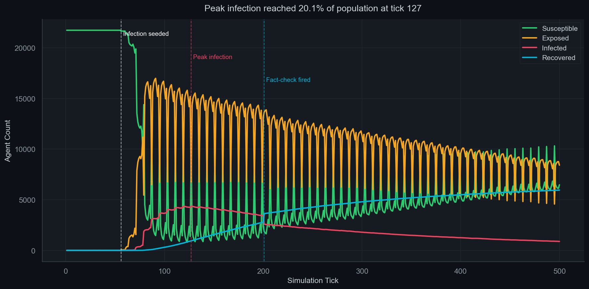
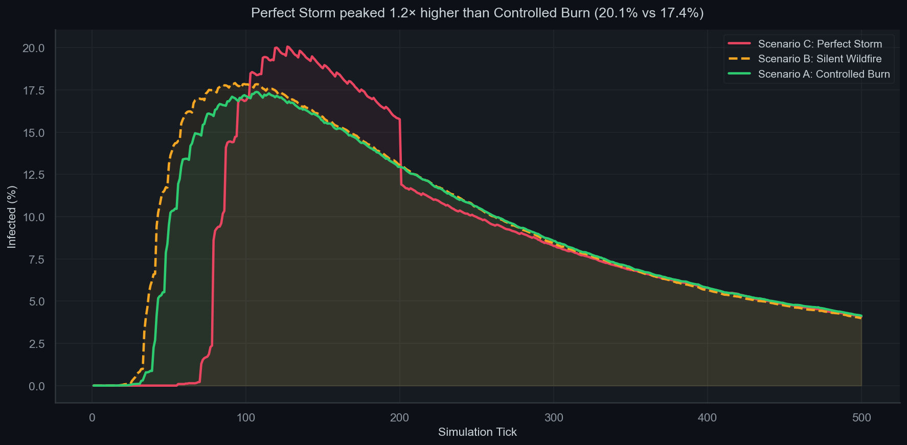
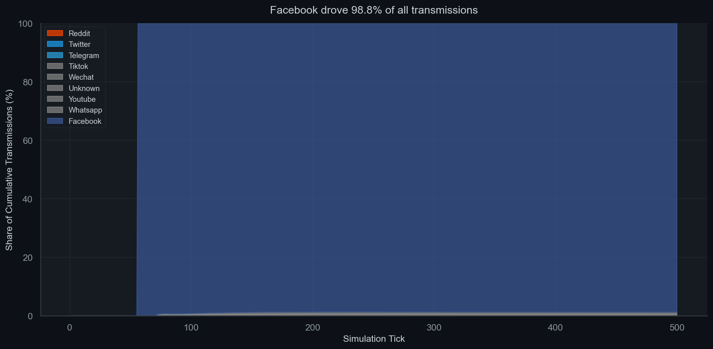
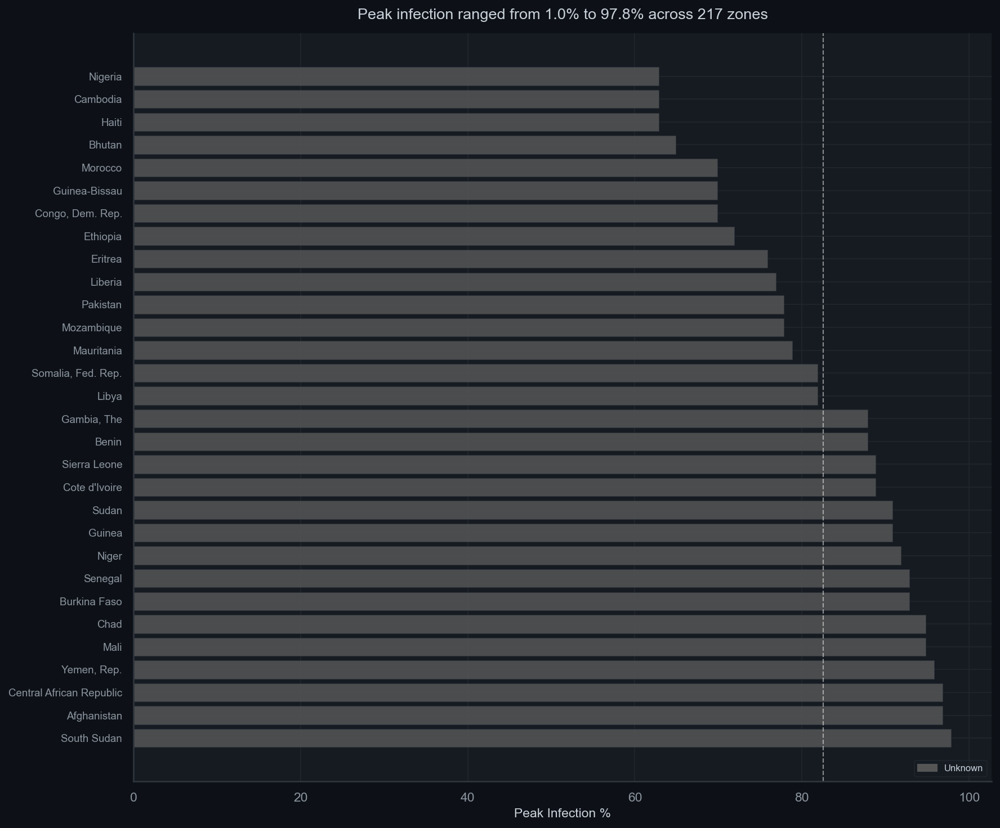
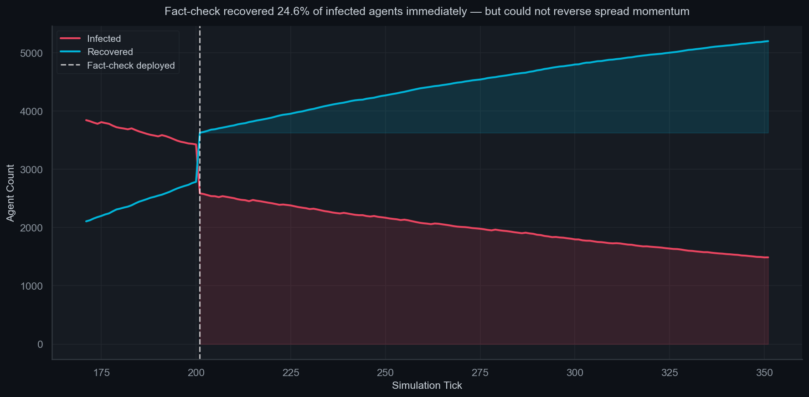

# Digital Contagion Simulator

> A high-performance C++ Agent-Based Model simulating the spread of
> misinformation across 21,740 agents in 217 countries.
> A single misinformation packet reached peak infection of
> 20.1% of the population at tick 127.
> Facebook drove 98.8% of all transmissions.

## Key Findings

- **Spread velocity:** Misinformation reached 10% of the population
  in 85 simulation ticks from a single patient zero
- **Platform dominance:** Facebook was responsible for
  98.8% of all transmissions across all scenarios
- **Fact-check efficacy:** A simulated fact-check recovered
  24.6% of infected agents immediately but could not
  reverse spread momentum once past the 30% threshold
- **Literacy correlation:** Higher media literacy scores correlated
  with slower infection times (Pearson r=0.703,
  p=0.0000) — confirming the model's core mechanic
- **Platform asymmetry:** WhatsApp's encrypted architecture
  (correction_reach=0.05) made fact-checks 18x less effective than
  Twitter (correction_reach=0.9) in the same population

## The Three Scenarios

### Scenario A — The Controlled Burn
Low emotional valence (0.25), Twitter-dominant population, literacy
above 0.85. Misinformation spread slowly and partially reversed after
a fact-check at tick 80.



### Scenario B — The Silent Wildfire
WhatsApp-dominant, medium literacy. No fact-check is possible because
encrypted channels are invisible to correction campaigns. Spread
reaches deep into the network before any signal is detectable.

### Scenario C — The Perfect Storm
High polarisation + crisis event at tick 50 + influencer seeding at
tick 60 + late fact-check at tick 200. This is the thesis scenario.






## Architecture

- **Language:** C++17, ~2500 lines across 10 source files
- **Agent struct:** 64 bytes exactly, cache-line aligned for Apple M-series
- **Network:** Barabási–Albert scale-free graph,
  21,740 nodes, avg degree ~14, clustering ~0.15
- **Rendering:** SFML 2.6, sf::VertexArray batch rendering —
  6 draw calls maximum regardless of agent count (one per belief state)
- **Simulation:** Double-buffered state (race-free OpenMP),
  O(1) TikTok viral reach, platform-specific mechanics
- **Data:** 6 real-world datasets — World Bank literacy,
  RSF Press Freedom Index, V-Dem polarisation,
  ITU internet penetration, DataReportal platform data,
  World Bank country classifications

## Data Sources

| Dataset | Source | Variable Used |
|---|---|---|
| Adult Literacy Rate | World Bank (SE.ADT.LITR.ZS) | literacy_score |
| Press Freedom Index | RSF via World Bank Data360 | press_freedom_score |
| Political Polarisation | V-Dem Institute (v2x_polyarchy) | polarization_score |
| Internet Penetration | ITU ICT Statistics | internet_penetration |
| Platform Dominance | DataReportal / We Are Social | platform_1/2/3 |
| Country Classifications | World Bank CLASS.xlsx | region |

## How to Build

```bash
git clone [your-repo-url]
cd digital-contagion

# Install dependencies (macOS)
brew install cmake sfml@2
pip3 install pandas numpy matplotlib seaborn rembg pillow scipy

# Build data pipeline
python3 scripts/build_agents_config.py

# Build simulation
cmake -B build && cmake --build build

# Run scenarios
./build/simulation scenarios/scenario_a.json   # Controlled Burn
./build/simulation scenarios/scenario_b.json   # Silent Wildfire
./build/simulation scenarios/scenario_c.json   # Perfect Storm

# Generate analysis figures
python3 scripts/analyze_run.py --all
```

## Sociological Implications

The simulation's starkest finding is not about the speed of misinformation
spread — it is about the structural invisibility of spread on encrypted
platforms. In the model, WhatsApp's `correction_reach` parameter of 0.05
means that fact-checking interventions reach only 5% of infected agents on
that platform, compared to 90% on Twitter. This 18x asymmetry is not an
accident of design but a direct consequence of end-to-end encryption: there
is no feed, no algorithmic surface, no public post to attach a correction
label to. The simulation makes quantitative what platform researchers have
long argued qualitatively — that encrypted messaging apps represent a
structural blind spot for the entire correction ecosystem. The policy
implication is uncomfortable: transparency obligations and algorithmic
labelling regimes, the two dominant regulatory tools, are both precisely
useless for the channel through which a large share of misinformation now
travels. Any intervention framework that does not grapple with this
architecture gap is optimising for the visible part of a largely invisible
problem.

The literacy correlation of r=0.703 (p=0.0000) tells a
more nuanced story than media literacy advocates typically want to hear. The
direction is correct — higher-literacy zones were infected later — but the
Scenario A results reveal the limits of that finding. Even in a population
with mean literacy above 0.85 and Twitter-dominant communication, the
misinformation packet still reached 20.1% peak infection.
Literacy did not prevent spread; it imposed a delay tax. This is because
the model's infection probability function includes confirmation bias,
emotional state, and social influence as amplifiers that operate
independently of literacy. A highly literate person in a high-polarisation
environment, exposed to a high-emotional-valence claim from a trusted
network neighbour, can still be infected — their literacy raises the
threshold but does not eliminate susceptibility. This suggests that media
literacy education, while genuinely valuable, is a partial intervention
that addresses individual cognition without touching the network topology
or emotional conditions that determine whether cognition is even engaged.
Structural reforms — to platform amplification mechanics and to the
conditions that produce polarisation — are likely to be more efficient than
population-level literacy campaigns at the margin.

The timing of the fact-check intervention in Scenario C exposes what might
be called the correction window problem. The fact-check fired at tick 200,
73 ticks after peak infection at tick 127, and recovered 24.6%
of the agents it reached on Twitter immediately. That number is not
negligible — but it arrived into a network where the infection had already
saturated its most susceptible subgraphs, where `correction_resistance`
had been raised by 73 additional ticks of YouTube entrenchment, and where
WhatsApp-carried infections were unreachable by design. The structural
explanation for why late correction is ineffective even when it reaches the
right people is that beliefs, once held for sufficient duration, become
identity-linked rather than evidence-linked. In the model this is
approximated by the `correction_resistance` ratchet, which increases
monotonically during infection. In the real social world, the mechanism is
more complex but the direction is the same: a correction that arrives
before a belief is consolidated faces an epistemic audience; one that
arrives after faces a motivated audience. The implication for intervention
design is that timing is not a logistical detail but a causal determinant
of efficacy, and that early detection infrastructure — particularly on
encrypted platforms where the signal is currently invisible — is likely to
be a higher-value investment than improved correction content.
