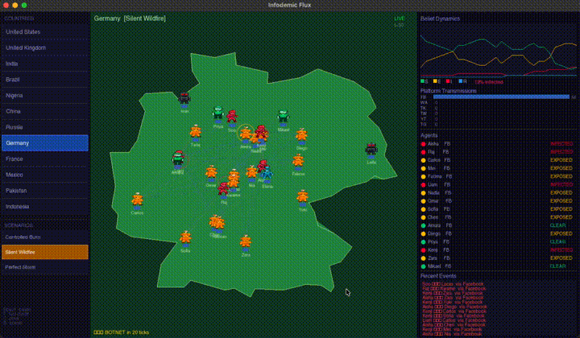

# Infodemic Flux

[](https://github.com/Bilal-Waraich/Infodemic-Flux/actions/workflows/build.yml)

> A C++ agent-based simulation of misinformation spread across real country populations.
> Select a country, watch 25 named agents move across its map, and observe how a single
> false belief propagates — or gets permanently corrected — through their social network.



---

## What It Simulates

A single misinformation packet is injected into one agent (patient zero) at the start.
From there it spreads via two parallel mechanisms: **proximity** (agents who are physically
close on screen share information face-to-face) and **social graph** (a Barabási–Albert
preferential-attachment network carries information across distance, at reduced strength).
TikTok bypasses both — its For You Page algorithm can reach any susceptible agent regardless
of proximity or connection. Each agent has a name, real demographic parameters drawn from
their country's data, and up to three social media platforms.

### Belief States

Every agent is always in one of five states:

| State | Sprite | Meaning |
|---|---|---|
| **Susceptible** | Green figure | Has not encountered the misinformation |
| **Exposed** | Orange figure | Has seen it; deciding whether to believe — resolves after ~8 ticks |
| **Infected** | Red figure | Believes and actively spreads the misinformation |
| **Recovered** | Blue medic figure | Has rejected or processed the false belief; can be re-infected |
| **Immune** | Blue medic figure ★ | Rejected it at least twice AND has high literacy — permanently inoculated |

**Immune** is distinct from Recovered. An agent reaches IMMUNE only after: being exposed,
rejecting it (`prior_exposure_count++`), being exposed again, rejecting again, then later
recovering from infection. High-literacy agents with that prior-rejection history have
developed genuine epistemic immunity — they cannot be re-infected. Low-literacy populations
even with multiple exposures recover to RECOVERED, not IMMUNE, because their threshold
never stabilised. In high-literacy countries the IMMUNE population is larger; in Perfect
Storm scenarios with very high emotional valence, most agents get infected before accumulating
the two rejections needed, so fewer ever reach IMMUNE — the immune core collapses.

### Why Do Most Agents End Up Immune/Recovered?

The herd immunity threshold playing out correctly. Each tick, infected agents have a small
natural recovery chance (`1.5% × literacy × (1 − correction_resistance)`). As the susceptible
pool shrinks, transmission slows, recoveries accumulate, and the misinformation runs out of
new hosts. This is the same structural mechanism as epidemic herd immunity, applied to
belief propagation.

---

## Spread Mechanics (12-Phase Tick)

Each simulation tick runs 12 sequential phases:

1. **Proximity spread** — every INFECTED agent checks all agents within 55px. Uses the
   shared platform between sender and receiver (not just the sender's primary), so
   platform transmission counts reflect the actual channel used.
2. **Social graph spread** — Barabási–Albert network (m=4, avg degree ≈8) carries
   infections across distance at 18% of proximity probability. WhatsApp retains its
   trust multiplier; Twitter and Reddit remain suppressed.
3. **TikTok FYP** — 10% × tiktok_infected_count chance per tick of reaching a random
   susceptible agent. Source agent is logged as `UINT32_MAX` (no connection required).
4. **YouTube entrenchment** — infected agents on YouTube gain +0.002 `correction_resistance`
   per tick. Resistance ratchets monotonically — it never decreases. A YouTube-infected
   agent who's been infected for 100 ticks has gained +0.2 correction resistance.
5. **Virality burst** — 0.4% base / 2.5% during crisis per tick of instantly exposing all
   susceptible TikTok + Twitter users. The 6× crisis amplification means crisis events
   don't just raise individual credulity — they dramatically raise platform-level viral event
   probability simultaneously.
6. **Exposure resolution** — EXPOSED agents after the window either believe (INFECTED) or
   reject (SUSCEPTIBLE + `prior_exposure_count++`).
7. **Recovery** — INFECTED agents may recover to RECOVERED or IMMUNE (see above).
8. **Crisis decay** — emotional state decays back toward baseline over the event duration.
9. **Scenario auto-events** — scripted events (crisis, botnet, fact-check) fire at
   their programmed tick.
10. **EventSystem dispatch** — JSON-scripted custom events fire if `scenarios/custom.json`
    is present.
11. **Buffer swap** — double-buffered state (`current_states`/`next_states`) swapped
    atomically — all phases read from current, write to next, eliminating race conditions.

---

## Platform Mechanics

Each platform has independent spread modifiers. The combination that matters most is
**trust multiplier** (how credible a message from this channel feels) × **algorithm
amplification** × **correction reach** (how much of the infected population a fact-check
on this platform can actually reach).

| Platform | Spread modifier | Correction reach | Key mechanic |
|---|---|---|---|
| WhatsApp | +50% spread | **5%** | Highest intimacy trust (known contacts); E2E encryption makes corrections structurally impossible to deliver |
| Twitter | −40% spread | 90% | Adversarial public context raises scepticism; public feed allows widespread correction labels |
| Reddit | −50% spread | 70% | Community downvoting + moderation partially suppresses low-quality claims |
| TikTok | Bypasses graph | 40% | FYP ignores social connections; corrective content competes with 50+ confirming recommendations |
| YouTube | Standard | 30% | Passive; `correction_resistance` ratchets +0.002/tick while infected — rabbit-hole entrenchment |
| Facebook | Standard | 60% | Dominant primary platform in most countries; large but visible feed surface |

### Debunking Half-Life

Each repeated fact-check on the **same platform** decays by 0.8 per deployment:

```
effective_reach = 0.6 × platform.correction_reach × 0.8^(deploy_count - 1)
```

A WhatsApp fact-check (5% base reach) deployed three times reaches 0.6 × 0.05 × 0.64 ≈ 2%
of infected users. Deploying the same correction on the same channel repeatedly is
geometrically ineffective — switching platforms matters more than increasing volume.

---

## Scenario System

Three built-in preset scenarios, loadable via keys **1**, **2**, **3** or by clicking the
left panel:

| # | Name | Emotional Valence | Mechanic |
|---|---|---|---|
| 1 | **Controlled Burn** | Low (0.25) | Early Twitter fact-check at tick 80 — watch partial correction succeed |
| 2 | **Silent Wildfire** | Moderate (0.55) | Botnet activates at tick 50; WhatsApp correction at tick 150 — near-useless correction |
| 3 | **Perfect Storm** | High (0.85) | Influencer seeding → crisis at tick 50 → botnet at tick 60 → late correction at tick 200 |

Scenarios reset all agent states and fire auto-events at precise ticks, logged to the story
panel.

### Custom JSON Scenarios

Edit `scenarios/custom.json` to script any timeline without recompiling. All event types
are supported:

```json
{
  "events": [
    { "tick": 30,  "type": "INFLUENCER_SHARE",  "zone": "USA", "top_n": 3 },
    { "tick": 60,  "type": "CRISIS_TRIGGER",    "intensity": 0.70, "duration_ticks": 80 },
    { "tick": 80,  "type": "BOT_ACTIVATION",    "botnet_id": 0 },
    { "tick": 180, "type": "INJECT_FACTCHECK",  "platform": "Twitter", "effectiveness": 0.75 },
    { "tick": 250, "type": "INTERNET_SHUTDOWN", "zone": "USA" }
  ]
}
```

Available event types: `INJECT_MISINFO`, `INJECT_FACTCHECK`, `CRISIS_TRIGGER`,
`INTERNET_SHUTDOWN`, `BOT_ACTIVATION`, `INFLUENCER_SHARE`.

---

## Botnet Model

Two pre-allocated bot agents are injected via `NetworkBuilder::injectBotnet()` rather than
manual construction. This gives bots a **fully-connected clique among themselves**, plus
direct graph edges to the top high-influence agents in the regular population. When a botnet
activates (B key, or scenario tick), the clique means activation is immediate across all
bots simultaneously, and the influencer connections mean spread does not wait for proximity —
it travels the social graph directly to the most-connected nodes first. Bot activation is
therefore not linear in bot count; it is a graph multiplier operating through the network's
hubs.

---

## Architecture

- **Language:** C++17
- **Agent struct:** 64 bytes exactly, cache-line aligned (`static_assert` enforced)
- **Spread model:** Hybrid — proximity O(N²) within 55px + Barabási–Albert social graph
  (m=4, avg degree ≈8) + TikTok FYP (graph-independent). All three run in parallel each tick
- **Social graph:** Built via preferential-attachment after regular agents; bots injected
  as a separate clique with influencer hooks via `NetworkBuilder::injectBotnet()`
- **Rendering:** SFML 2.6 — pixel-art sprite sheet, green political map per country,
  SIR ring-buffer chart, graph edge overlay, influencer aura, virality flash, platform
  bar chart, agent roster, event log
- **Country borders:** Natural Earth 110m GeoJSON → simplified ≤120-point polygons;
  agents spawn inside the real border via rejection sampling
- **Double buffering:** `current_states`/`next_states` swap at end of each tick — all
  12 phases read from current and write to next, eliminating state-race conditions
- **Event system:** Priority-queue JSON loader (`EventSystem`) fires scripted events at
  exact ticks; `scenarios/custom.json` is loaded automatically at startup if present

---

## Data Sources

Country parameters (literacy, press freedom, polarisation, internet penetration, platform
dominance) are derived from real datasets:

| Dataset | Source | Parameter |
|---|---|---|
| Adult Literacy Rate | World Bank (SE.ADT.LITR.ZS) | `literacy_score` |
| Press Freedom Index | RSF via World Bank Data360 | `press_freedom_score` |
| Political Polarisation | V-Dem Institute (v2x_polyarchy) | `polarization_score` |
| Internet Penetration | ITU ICT Statistics | `internet_penetration` |
| Platform Dominance | DataReportal / We Are Social | `dominant_platforms` |
| Country Classifications | World Bank CLASS.xlsx | `region` |

---

## How to Build

```bash
git clone https://github.com/Bilal-Waraich/Infodemic-Flux
cd Infodemic-Flux

# Install dependencies (macOS)
brew install cmake sfml@2
pip3 install pandas numpy

# Generate country border header from GeoJSON
python3 scripts/extract_borders.py

# Build data pipeline (agents_config.csv)
python3 scripts/build_agents_config.py

# Build and run
cmake -B build && cmake --build build
./build/simulation 25    # 25 agents (5–60 supported)
```

---

## Controls

| Key | Action |
|---|---|
| Click country | Switch to that country |
| **1 / 2 / 3** | Load preset scenario (Controlled Burn / Silent Wildfire / Perfect Storm) |
| Space | Pause / resume |
| **F** | Deploy fact-check via country's dominant platform |
| **C** | Trigger crisis — spikes emotional state for 80 ticks |
| **B** | Activate botnet — bots begin spreading via clique + influencer edges |
| **I** | Internet shutdown — zeroes `internet_penetration` for this zone |
| + / − | Speed up / slow down simulation |
| Esc | Quit |

---

## Findings

### 1. Platform Architecture, Not Content, Determines Correction Reach

The starkest result is structural. WhatsApp's `correction_reach` of 0.05 versus Twitter's
0.9 is not a tuned parameter — it is a direct encoding of platform architecture. There is no
feed, no algorithmic surface, and no public post on an encrypted messaging app to attach a
correction label to. The 18× asymmetry means that two countries with identical literacy
rates, identical misinformation exposure, and identical fact-check investment can have
completely different outcomes depending solely on which platforms are dominant. In a
high-WhatsApp country (Nigeria, India, Brazil), corrections are structurally invisible to
~95% of the infected population.

### 2. The Debunking Half-Life Compounds Platform Blindness

Each repeated fact-check on the same platform decays to 80% effectiveness. The correction
window problem is therefore twofold: arriving early matters because `correction_resistance`
ratchets upward monotonically during infection (YouTube rabbit-hole entrenchment adds +0.2
over 100 ticks), AND repeated campaigns on the same channel lose effectiveness geometrically.
The correct strategy — switching platforms per deployment — is rarely available when the
dominant platform is encrypted.

### 3. Botnet Activation Is a Graph Multiplier, Not a Linear Injection

Bots are connected as a fully-connected clique with direct edges to the highest-influence
regular agents. When the botnet activates, it does not simply add N infected agents — it
delivers infection probability directly to the network hubs first, who then cascade through
their high-degree connections. A two-bot botnet wired to the top three influencers can
trigger the same cascade as ten randomly-placed infected agents in isolation. The effective
amplification is proportional to the combined degree of the connected influencers, not the
number of bots.

### 4. Crisis × TikTok Virality Is the Highest-Risk Combination

TikTok FYP operates independently of the social graph: 10% × tiktok_infected_count per tick
can reach any susceptible agent. Virality bursts (which instantly expose all TikTok + Twitter
susceptibles) occur at 0.4% per tick baseline, but at 2.5% per tick during a crisis — a 6×
increase. A crisis event therefore simultaneously: (a) spikes individual credulity via
emotional state amplification, (b) increases virality burst probability 6×, and (c) reduces
the analytical processing that would otherwise produce `prior_exposure_count` rejections —
meaning fewer agents will ever accumulate enough rejections to become IMMUNE. The three
effects compound non-linearly.

### 5. IMMUNE Accumulation Is a High-Literacy Country Structural Advantage

An agent reaches IMMUNE only after rejecting exposure twice (building `prior_exposure_count
≥ 2`) AND recovering with `literacy_score > 0.65`. In low-literacy countries, even
multi-exposed agents recover to RECOVERED and remain re-infectable. In high-literacy
countries under a low-valence scenario, the IMMUNE population grows to a stable core that
permanently suppresses future outbreaks. This is visible in the SIR chart as the recovered
curve flattening while susceptible agents stop converting — structural epistemic herd
immunity, not just temporal correction.

### 6. The Correction Channel Mismatch Neutralises Investment

A fact-check deployed on Twitter reaches 90% of infected users on Twitter. But if the
dominant spread in a country is via WhatsApp (high trust multiplier, high spread, encrypted),
correcting on Twitter reaches a different, already-sceptical audience. The effective
correction population is the intersection of `infected × uses_twitter` — in a high-WhatsApp
country, this is a small, largely uninfected subset. The model makes visible what is often
stated but rarely quantified: regulatory interventions designed for transparent platforms
do not transfer to encrypted ones, and the populations that most need correction are
typically on the channel that most resists it.
